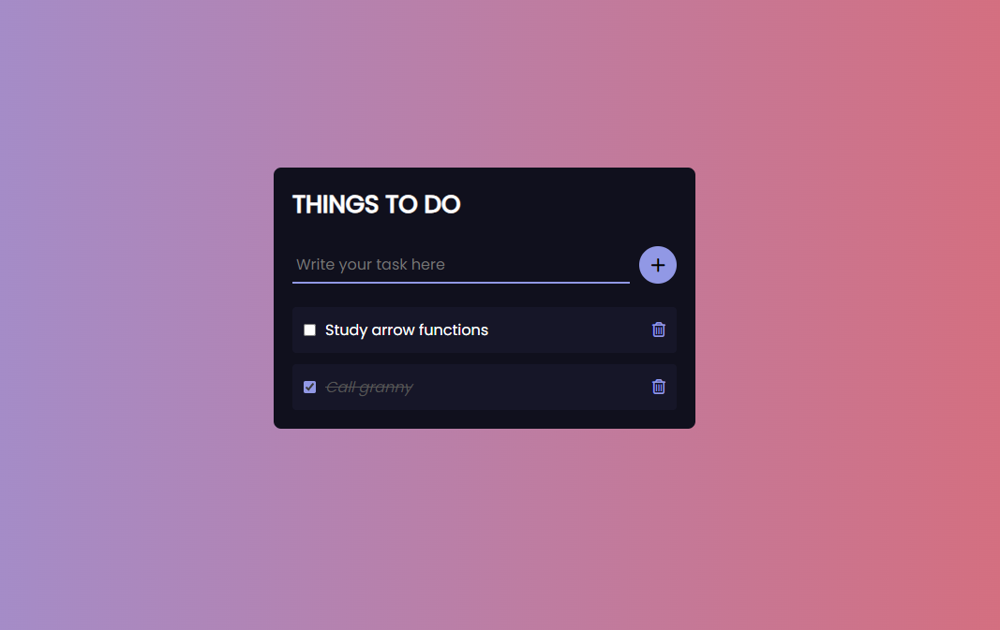

# To-do list

## An application to save a list of things you have to do.

Simple application that allows the user to save an task, delete it, and check if it is done.

### Features
- [x] Auto saving at the local storage.
- [x] Possibility to check or delete a task.

### 🛠 Technologies

The following tools were used to build this project:

- JavaScript
- HTML
- CSS

### Author
---

<a href="#">
 
  
 <b>Claudio Henrique</b></a> <a href="#" title="Rocketseat">☕</a>

Made by Claudio Henrique 👋🏽 get in touch!

 
